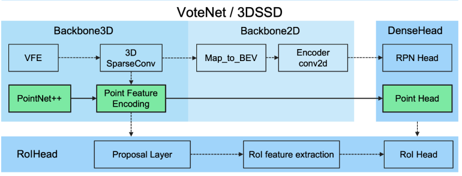

## 3DSSD-torch

This is the 3DSSD implementation rewritten based off [OpenPCDet](https://github.com/open-mmlab/OpenPCDet) framework. The code is orginized by the guideline given in the official repo as the figure below:



### Requirements
The codes are tsted under the following environment:

- Ubuntu 18.04
- Python 3.7
- Pytorch 1.7.1
- CUDA 11.1

### Installation

The procedure is identical to the office installation guide of [OpenPCDet](https://github.com/open-mmlab/OpenPCDet/blob/master/docs/INSTALL.md), you can also refer to the following:

1. Install required dependency by running ```pip install -r requirements.txt```.

2. Install the OpenPCDet related libraries by running ```python setup.py develop```

3. Refer to the [link](https://github.com/traveller59/spconv) to install spconv (although not used in the repo, install for the ease of not modifying the original codebase)

4. Preprocess KITTI dataset by running the following command from project directory: ```python -m pcdet.datasets.kitti.kitti_dataset create_kitti_infos tools/cfgs/dataset_configs/kitti_dataset.yaml```

### Train

Train the 3DSSD model by running the command in ```tools``` directory: 

```python train.py --cfg_file cfgs/kitti_models/3dssd.yaml ```

### Pretrained Model

The pretrained models are provided in the output folder under ckpt directory, you can examine the pretrained model from ```tools``` directory by:

```python test.py --cfg_file cfgs/kitti_models/3dssd.yaml --ckpt ../output/kitti_models/3dssd/default/ckpt/checkpoint_epoch_120.pth```

### Performance

I managed to yield reasonable results for all three classes in KITTI dataset: Car, Pedestrain and Cyclist as follow all under __R11__ criteria, if you are interested in __R40__ result as well, refer to the output folder.

```
Car AP@0.70, 0.70, 0.70:
bbox AP:96.4641, 90.0299, 89.4182
bev  AP:89.9948, 87.9284, 85.8481
3d   AP:88.5553, 78.4563, 77.3031
aos  AP:96.43, 89.94, 89.25
Pedestrian AP@0.50, 0.50, 0.50:
bbox AP:72.2514, 69.3984, 64.1170
bev  AP:63.2845, 58.1731, 55.0167
3d   AP:58.1822, 54.3187, 49.5647
aos  AP:65.99, 62.96, 57.97
Cyclist AP@0.50, 0.50, 0.50:
bbox AP:94.4852, 82.3373, 77.1431
bev  AP:92.4290, 73.7010, 70.8207
3d   AP:86.2519, 70.4854, 65.3238
aos  AP:94.41, 81.76, 76.66
```

### Acknowledgement
Many thanks to [qiqihaer](https://github.com/qiqihaer) and his excellent work on reimplmentation of 3DSSD. I borrowed some code from his [repo](https://github.com/qiqihaer/3DSSD-pytorch-openPCDet) including part of the head and coder. 

Also I refered to the code from [MMdetection3D](https://github.com/open-mmlab/mmdetection3d) to make the code structure more organized.
